## GenAI Agents 실습
- 실습은 GenAI Agent가 지원되는 Ashburn/Sao Paulo/Frankfrut/Osaka/London/Chicago/Phoenix (2025. 12 기준) 리전에서 진행합니다.
### 실습 아키텍처
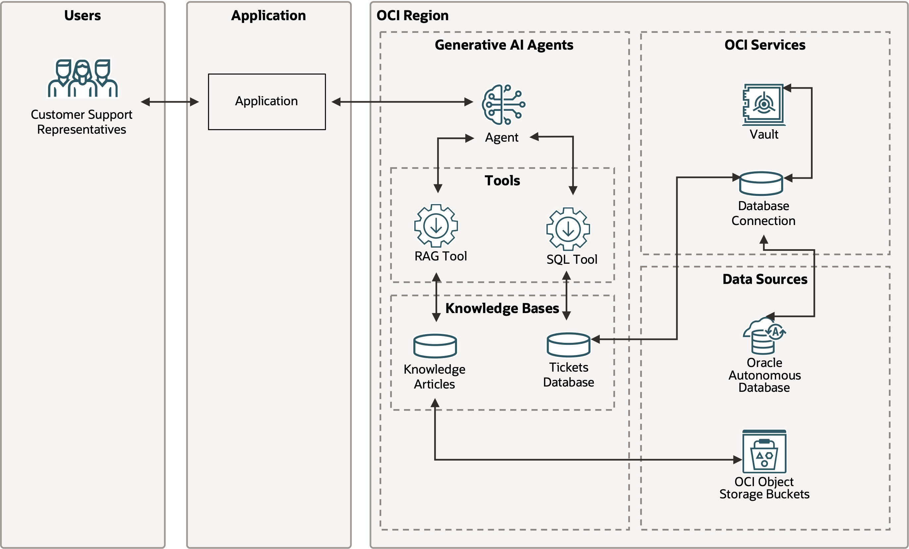
- 스토리지 버킷: 지식 문서(워크숍 제공)를 저장하며, 고객 지원 담당자가 고객 티켓을 해결할 때 해당 문서에서 필요한 정보를 가져옵니다.
- 볼트(Vault): ADB 인스턴스에 접근하는 데 필요한 자격 증명을 안전하게 저장합니다.
데이터베이스 커넥션: ADB 인스턴스에서 데이터를 검색하기 위한 정보가 담겨 있으며, 자격 증명을 볼트에서 안전하게 가져옵니다.
- 지식 베이스(Knowledge Base): 두 개의 데이터 소스(스토리지 버킷과 ADB 인스턴스)를 참조하며, 각기 다른 에이전트 도구에서 사용됩니다.
- RAG 도구: 에이전트가 스토리지 버킷에 저장된 비정형 지식 문서에서 정보를 검색·분석·추론할 때 사용합니다. 출처 문서, 페이지, 단락 등도 제공할 수 있습니다. 텍스트 및 PDF 파일, 그리고 PDF 내 이미지 분석도 가능합니다.
- SQL 도구: 에이전트가 ADB 인스턴스에 저장된 정보를 검색·분석·응답할 때 사용합니다. 자연어 요청을 SQL 쿼리로 변환해 정보를 검색합니다.
- 에이전트: 사용자의 요청을 받아 실행 계획을 세우고, 필요할 경우 추가 질문 후, 적절한 도구를 활용해 정보를 수집·종합해 일관된 응답을 제공합니다.

### 1-1. 준비 작업 - Policy 설정 (향후 고객사 실습을 위해 작성해 둔것으로, apackrsct 테넌시 내에서는 skip하셔도 됩니다.)
- OCI Generative AI Agents 서비스와 Object Storage, ADB, Key Vault 등 실습에서 사용할 다양한 서비스에 접근할 수 있도록 필요한 정책(Policy)을 생성합니다.
- 메뉴 > Identify & Security > Domains > OracleIdentityCloudService > Dynamic Group > Create dynamic group 클릭합니다. 
```
Name: oci-genai-agents-service
Matching Rules: Match any rules defined below
Rule1: ANY {resource.type='genaiagentdataingestionjob', resource.type='genaiagent'}
```
- 'Create' 버튼을 클릭합니다.
- 메뉴 > Identity & Security > Policies > Create Policy 클릭합니다.
```
Name: oci-genai-agents-policy
Compartment: root
show manual editor > Policy Builder 내에 아래 policy 입력
allow group <your-user-group-name> to manage genai-agent-family in tenancy
allow group <your-user-group-name> to manage object-family in tenancy
allow group <your-user-group-name> to manage secret-family in tenancy
allow dynamic-group oci-genai-agents-service to read objects in tenancy
allow dynamic-group oci-genai-agents-service to read secret-bundle in tenancy
allow dynamic-group oci-genai-agents-service to read database-tools-family in tenancy
```
-'Create' 버튼을 클릭합니다.

### 1-2. 준비 작업 - Bucket 생성
- 버킷에 업로드할 지식 문서 PDF는 고객 지원 담당자가 고객 문제를 해결하기 위해 전문적인 내부 지식이 필요할 때마다 에이전트가 사용합니다.
- 본인 할당 Compartment에서 실습을 진행합니다. 
- 메뉴 > Storage > Buckets > Create Bucket 버튼을 클릭합니다.
```
Name: Knowledge-base-EH(본인이름이니셜)
나머지는 기본 설정 그대로 진행
```
- 'Create' 버튼을 클릭합니다.
- 실습 폴더에 들어있는 knowledge-articles.zip파일을 unzip합니다.
- 앞서 생성해 둔 Bucket(Knowlege-base-본인이름)에 8개 파일을 모두 업로드 합니다.

### 1-3. 준비 작업 - ADB 생성
- 메뉴 > Oracle AI Database > Autonmous AI Database > Create AI Autonomous Database를 클릭합니다.
```
Display name: customer-support-EH(본인이름이니셜)
Database name: custoemrssuportEH(본인이름이니셜)
Compartment: 본인 컴파트먼트 선택
Workload type: Lakehouse
Developer: Enable(활성화)
Choose Database Version: 26ai
Password: WElcome123__
Network access: secure access from everywhere
```
- 'Create' 버튼을 클릭하고, ADB 생성이 완료될 때까지 기다립니다.

### 1-4. 준비 작업 - ADB 데이터 생성
- 앞서 생성해둔, ADB 인스턴스를 클릭합니다. Datbase actions > SQL을 클릭하여 SQL Worksheet에 아래 schema를 생성합니다.
```sql
CREATE TABLE Customers (
    CustomerID NUMBER PRIMARY KEY,
    FirstName VARCHAR2(50) NOT NULL,
    LastName VARCHAR2(50) NOT NULL,
    Email VARCHAR2(100) UNIQUE NOT NULL,
    Phone VARCHAR2(20),
    Address VARCHAR2(200)
);

CREATE TABLE SupportAgents (
    AgentID NUMBER PRIMARY KEY,
    FirstName VARCHAR2(50) NOT NULL,
    LastName VARCHAR2(50) NOT NULL,
    Email VARCHAR2(100) UNIQUE NOT NULL,
    Phone VARCHAR2(20)
);

CREATE TABLE TicketStatus (
    StatusID NUMBER PRIMARY KEY,
    StatusName VARCHAR2(50) NOT NULL
);

CREATE TABLE Tickets (
    TicketID NUMBER PRIMARY KEY,
    CustomerID NUMBER NOT NULL,
    Subject VARCHAR2(200) NOT NULL,
    Description CLOB NOT NULL,
    CreatedDate DATE DEFAULT SYSTIMESTAMP NOT NULL,
    LastUpdatedDate DATE DEFAULT SYSTIMESTAMP NOT NULL,
    StatusID NUMBER NOT NULL,
    AssignedToAgentID NUMBER,
    FOREIGN KEY (CustomerID) REFERENCES Customers(CustomerID),
    FOREIGN KEY (StatusID) REFERENCES TicketStatus(StatusID),
    FOREIGN KEY (AssignedToAgentID) REFERENCES SupportAgents(AgentID)
);

CREATE SEQUENCE CustomerSeq START WITH 1 INCREMENT BY 1;
/
CREATE OR REPLACE TRIGGER CustomerTrigger BEFORE INSERT ON Customers FOR EACH ROW BEGIN SELECT CustomerSeq.NEXTVAL INTO :NEW.CustomerID FROM DUAL; END;
/
CREATE SEQUENCE AgentSeq START WITH 1 INCREMENT BY 1;
/
CREATE OR REPLACE TRIGGER AgentTrigger BEFORE INSERT ON SupportAgents FOR EACH ROW BEGIN SELECT AgentSeq.NEXTVAL INTO :NEW.AgentID FROM DUAL; END;
/
CREATE SEQUENCE TicketSeq START WITH 1 INCREMENT BY 1;
/
CREATE OR REPLACE TRIGGER TicketTrigger BEFORE INSERT ON Tickets FOR EACH ROW BEGIN SELECT TicketSeq.NEXTVAL INTO :NEW.TicketID FROM DUAL; END;
/
CREATE SEQUENCE StatusSeq START WITH 1 INCREMENT BY 1;
/
CREATE OR REPLACE TRIGGER StatusTrigger BEFORE INSERT ON TicketStatus FOR EACH ROW BEGIN SELECT StatusSeq.NEXTVAL INTO :NEW.StatusID FROM DUAL; END;
```

- 다른데이터도 insert 하겠습니다.
```sql
INSERT INTO TicketStatus (StatusName)
VALUES
('New'),
('Open'),
('In Progress'),
('On Hold'),
('Resolved'),
('Closed'),
('Escalated'),
('Cancelled');
INSERT INTO SupportAgents (FirstName, LastName, Email, Phone)
VALUES
('Minji', 'Kim', 'minji.kim@support.com', '010-1234-5678'),
('Jisoo', 'Park', 'jisoo.park@support.com', '010-2345-6789'),
('Hyunwoo', 'Lee', 'hyunwoo.lee@support.com', '010-3456-7890'),
('Soyeon', 'Choi', 'soyeon.choi@support.com', '010-4567-8901'),
('Jiho', 'Kang', 'jiho.kang@support.com', '010-5678-9012'),
('Eunji', 'Yoon', 'eunji.yoon@support.com', '010-6789-0123'),
('Taeyoung', 'Jung', 'taeyoung.jung@support.com', '010-7890-1234'),
('Seoyun', 'Lim', 'seoyun.lim@support.com', '010-8901-2345'),
('Jiwon', 'Shin', 'jiwon.shin@support.com', '010-9012-3456'),
('Yuna', 'Kwon', 'yuna.kwon@support.com', '010-0123-4567'),
('Sunghoon', 'Baek', 'sunghoon.baek@support.com', '010-1324-5768'),
('Hayoung', 'Han', 'hayoung.han@support.com', '010-2435-6879'),
('Donghyun', 'Oh', 'donghyun.oh@support.com', '010-3546-7980'),
('Nari', 'Jang', 'nari.jang@support.com', '010-4657-8091'),
('Sangmin', 'Koo', 'sangmin.koo@support.com', '010-5768-9102'),
('Seulgi', 'Yoo', 'seulgi.yoo@support.com', '010-6879-0213'),
('Heejin', 'Nam', 'heejin.nam@support.com', '010-7980-1324'),
('Junseo', 'Seo', 'junseo.seo@support.com', '010-8091-2435'),
('Mijin', 'Hwang', 'mijin.hwang@support.com', '010-9102-3546'),
('Sumin', 'Ryu', 'sumin.ryu@support.com', '010-0213-4657');
INSERT INTO Customers (FirstName, LastName, Email, Phone, Address)
VALUES
('Jihyun', 'Kim', 'jihyun.kim@example.com', '010-1234-5678', '서울특별시 강남구 테헤란로 123'),
('Minho', 'Park', 'minho.park@example.com', '010-2345-6789', '부산광역시 해운대구 해운대로 456'),
('Seojin', 'Lee', 'seojin.lee@example.com', '010-3456-7890', '인천광역시 연수구 인천타워대로 789'),
('Yuna', 'Choi', 'yuna.choi@example.com', '010-4567-8901', '대전광역시 유성구 대학로 321'),
('Daehyun', 'Jeong', 'daehyun.jeong@example.com', '010-5678-9012', '광주광역시 북구 무등로 901'),
('Hyejin', 'Lim', 'hyejin.lim@example.com', '010-6789-0123', '울산광역시 남구 삼산로 777'),
('Jiwon', 'Yoon', 'jiwon.yoon@example.com', '010-7890-1234', '수원시 영통구 매탄로 999'),
('Sungmin', 'Jang', 'sungmin.jang@example.com', '010-8901-2345', '성남시 분당구 정자일로 111'),
('Soojin', 'Han', 'soojin.han@example.com', '010-9012-3456', '고양시 일산동구 중앙로 222'),
('Taeyoung', 'Kwon', 'taeyoung.kwon@example.com', '010-0123-4567', '창원시 의창구 창원대로 333'),
('Jisoo', 'Shin', 'jisoo.shin@example.com', '010-4321-5678', '청주시 상당구 상당로 444'),
('Jaeho', 'Hwang', 'jaeho.hwang@example.com', '010-5432-6789', '전주시 완산구 전주천동로 555'),
('Bomin', 'Song', 'bomin.song@example.com', '010-6543-7890', '천안시 서북구 두정로 666'),
('Seoyoung', 'Kang', 'seoyoung.kang@example.com', '010-7654-8901', '부천시 원미구 부일로 777'),
('Sungwoo', 'Ryu', 'sungwoo.ryu@example.com', '010-8765-9012', '안산시 단원구 중앙대로 888'),
('Areum', 'Oh', 'areum.oh@example.com', '010-9876-0123', '평택시 평택로 999'),
('Gyuri', 'Baek', 'gyuri.baek@example.com', '010-3210-1234', '안양시 동안구 시민대로 1110'),
('Hana', 'Nam', 'hana.nam@example.com', '010-2109-2345', '김해시 가야로 1212'),
('Jisung', 'Seo', 'jisung.seo@example.com', '010-1098-3456', '포항시 남구 희망로 1313'),
('Mina', 'Yoo', 'mina.yoo@example.com', '010-9087-4567', '제주시 한라로 1414');
INSERT INTO Tickets (CustomerID, Subject, Description, CreatedDate, LastUpdatedDate, StatusID, AssignedToAgentID)
VALUES
(2, '클라우드 컴퓨팅 마이그레이션 문제', '조직의 IT 인프라를 클라우드로 이전하는 과정에서, 원활
한 통합을 보장하고 다운타임을 최소화하는 데 어려움을 겪고 있습니다. 특히, 중요한 애플리케이션과 데
이터를 클라우드로 이전하면서 기능성과 성능을 유지하는 데 고민이 많습니다. 위험 평가, 애플리케이션
평가, 데이터 이전 전략 등을 포함한 맞춤형 마이그레이션 계획 수립과 최적의 클라우드 인프라 구성 방
안에 대해 전문가의 도움이 필요합니다.', TO_DATE('12-SEP-24', 'DD-MON-YY'), TO_DATE('12-SEP-24', 'DD-MON-YY'), 4, 2),
(4, '가상 사설망(VPN) 구성', '분양권 전매제한 기간이 언제부터 언제까지 적용되는지, 그리고 전매제한 도중 부득이하게 전매가 필요한 경우 허용되는 예외 사유에 대해 알고 싶어요.', TO_DATE('14-SEP-24', 'DD-MON-YY'), TO_DATE('14-SEP-24', 'DD-MON-YY'), 4, 2),
(6, '네트워크 모니터링 및 분석', '원격 사용자들이 조직의 내부 리소스에 안전하게 접근할 수 있도록
VPN을 구성하려고 하는데, 적합한 프로토콜 선정과 서버 및 클라이언트 설정 등의 인프라 구축에 어려움
을 겪고 있습니다. 어떤 VPN 프로토콜을 선택할지, 서버를 어떻게 설치할지, 클라이언트 배포 방법 등,
보안성과 신뢰성을 모두 만족하는 VPN 솔루션 설계 및 구현에 대한 전문가의 조언을 부탁드립니다.', TO_DATE('16-SEP-24', 'DD-MON-YY'), TO_DATE('16-SEP-24', 'DD-MON-YY'), 1, 6),
(8, '데이터 백업 및 복구', '조직의 핵심 데이터 무결성과 가용성 보장을 위해 효과적인 데이터 백업 및 복구 전략 수립에 어려움을 겪고 있습니다. 적합한 백업 솔루션 선정, 백업 스케줄 설정, 복구 절차 테스트 등에서 도움이 필요하며, 백업 기술, 저장소 옵션, 재해 복구 방안에 대한 전문가의 설계와 조언을 원합니다.', TO_DATE('20-SEP-24', 'DD-MON-YY'), TO_DATE('20-SEP-24', 'DD-MON-YY'), 4, 8),
(10, '네트워크 아키텍처 설계', '비즈니스 확장에 맞는 확장성 높고 효율적인 네트워크 아키텍처 설계를 담당하고 있으나, 최적의 토폴로지 선택, 네트워크 장비 구성, 기존 인프라와의 연동에 어려움이 있습니다. 네트워크 설계 원칙, 기술 선택, 구현 전략 등 전문적 가이드가 필요합니다.', TO_DATE('22-SEP-24', 'DD-MON-YY'), TO_DATE('22-SEP-24', 'DD-MON-YY'), 5, 10),
(12, '재해 복구 계획 수립', '조직의 재해 복구 계획을 수립하는 과정에서 중요 시스템과 데이터 식별, 위험 평가, 효과적인 복구 전략 개발에 대한 어려움이 있습니다. 적합한 복구 방식 선정, 복구 절차 설정, 계획 효과성 테스트 등 종합적인 재해 복구 방안에 대해 전문가의 조언이 필요합니다.', TO_DATE('28-SEP-24', 'DD-MON-YY'), TO_DATE('28-SEP-24', 'DD-MON-YY'), 2, 12),
(14, '네트워크 침투 테스트', '조직 네트워크 인프라의 취약점을 식별하기 위해 침투 테스트를 진행하고자 하지만, 어떤 도구와 절차를 사용할지, 결과 해석 방법에서 어려움이 있습니다. 침투 테스트 계획, 추천 도구, 위험 평가 방법론에 대해 전문적인 가이드를 요청합니다.', TO_DATE('30-SEP-24', 'DD-MON-YY'), TO_DATE('30-SEP-24', 'DD-MON-YY'), 3, 14),
(16, '인시던트 대응 계획', '조직의 인시던트 대응 계획 수립을 맡고 있으나, 중요한 사고 유형 식별, 위험 평가, 효과적인 대응 전략 개발에 애로가 있습니다. 적절한 대응 방안 선정, 절차 설정, 계획 테스트에 관한 전반적인 설계와 조언이 필요합니다.', TO_DATE('02-OCT-24', 'DD-MON-YY'), TO_DATE('02-OCT-24', 'DD-MON-YY'), 1, 16),
(18, '느린 네트워크 속도', '매우 느린 네트워크 속도로 업무 수행에 지장이 있습니다. 속도 측정 결과 다운로드는 5 Mbps, 업로드는 1 Mbps도 나오지 않습니다. 서비스 장애 원인을 점검해주시고 해결 방안을 제시해주시면 감사하겠습니다.', TO_DATE('03-SEP-24', 'DD-MON-YY'), TO_DATE('03-SEP-24', 'DD-MON-YY'), 1, 1),
(1, '간헐적인 접속 문제', '랜덤하게 인터넷 연결이 끊어져서 라우터를 재시작해야만 다시 연결할 수 있습니다. 케이블 점검 등 기본적인 방법은 시도했으나 문제가 지속되고 있습니다. 원인 파악과 해결 방법에 대한 도움을 구합니다.', TO_DATE('07-SEP-24', 'DD-MON-YY'), TO_DATE('07-SEP-24', 'DD-MON-YY'), 1, 3),
(3, '네트워크 혼잡', '심한 네트워크 혼잡으로 인해 속도 저하와 연결 끊김 현상이 발생합니다. 주로 저녁이나 주말 등 여러 기기를 동시에 사용할 때 증상이 심합니다. 요금제 업그레이드나 기타 대안에 대한 상담을 요청합니다.', TO_DATE('11-SEP-24', 'DD-MON-YY'), TO_DATE('11-SEP-24', 'DD-MON-YY'), 1, 5),
(5, '인터넷 장애', '우리 지역에 인터넷 장애가 발생해 많은 가정과 사업장에 영향이 있습니다. 이 문제가 기술적 문제인지 정기 점검과 관련된 것인지, 원인과 예상 복구 시각에 대한 안내가 필요합니다.', TO_DATE('04-SEP-24', 'DD-MON-YY'), TO_DATE('04-SEP-24', 'DD-MON-YY'), 1, 7),
(7, 'IT 서비스 관리', '조직의 IT 서비스(인시던트, 문제, 변경 관리 등)를 총괄하지만, 최적의 서비스 관리 프레임워크 선택, 프로세스 구축, 기존 인프라와 연동 등에 어려움이 있습니다. 서비스 관리 방안, 프로세스 구현, 도구 선정 등에 대한 전문적인 지침이 필요합니다.', TO_DATE('24-SEP-24', 'DD-MON-YY'), TO_DATE('24-SEP-24', 'DD-MON-YY'), 1, 9),
(9, '인터넷 연결 불가', '어젯밤 10시부터 인터넷이 완전히 되지 않습니다. 라우터 재시작을 여러 번 시도했지만 해결되지 않았고, 케이블 점검도 마쳤습니다. 신속한 문제 해결을 원합니다.', TO_DATE('01-SEP-24', 'DD-MON-YY'), TO_DATE('01-SEP-24', 'DD-MON-YY'), 1, 11),
(11, '방화벽이 인터넷 차단', '최근 방화벽을 설치한 후 일부 웹사이트 및 서비스 접속에 문제가 발생합니다. 필요한 트래픽만 허용하면서도 보안을 유지할 수 있도록 방화벽 설정에 대한 전문가의 도움을 요청합니다.', TO_DATE('06-SEP-24', 'DD-MON-YY'), TO_DATE('06-SEP-24', 'DD-MON-YY'), 1, 13),
(13, 'Wi-Fi 연결 안 됨', 'Wi-Fi가 완전히 작동하지 않습니다. 라우터와 모뎀 재시작 후에도 문제는 해결되지 않았습니다. 비밀번호를 정확히 입력했음에도 인증 오류가 발생하고, 아예 네트워크가 검색되지 않는 상황입니다. 신속한 점검과 조치를 부탁드립니다.', TO_DATE('05-SEP-24', 'DD-MON-YY'), TO_DATE('05-SEP-24', 'DD-MON-YY'), 1, 15),
(15, '모뎀 문제', '잦은 연결 끊김 및 느린 속도로 인해 모뎀에 문제가 있다고 생각됩니다. 모뎀 재시작 및 케이블 점검을 수차례 시도했지만 증상이 계속되고 있어 교체나 업그레이드가 필요할지 도움을 요청합니다.', TO_DATE('13-SEP-24', 'DD-MON-YY'), TO_DATE('13-SEP-24', 'DD-MON-YY'), 1, 17),
(17, '클라우드 보안 모범 사례', '조직의 클라우드 자산과 데이터를 보호할 수 있는 클라우드 보안 모범 사례 가이드가 필요합니다. 효과적인 보안 제어 선택, 설정, 규제 준수 등 전반에 대한 포괄적인 전략과 모범 사례 추천을 바랍니다.', TO_DATE('26-SEP-24', 'DD-MON-YY'), TO_DATE('26-SEP-24', 'DD-MON-YY'), 6, 19),
(19, '복잡한 네트워크 구성 문제', '여러 대의 라우터, 스위치, 방화벽을 사용한 복잡한 네트워크 구성을 하다가 지속적인 연결 문제와 느린 속도, 불안정한 성능을 겪고 있습니다. 신뢰할 수 있는 전문가의 점검과 종합적인 해결책이 필요합니다.', TO_DATE('02-SEP-24', 'DD-MON-YY'), TO_DATE('02-SEP-24', 'DD-MON-YY'), 1, 2),
(1, '고급 라우터 설정 문제', 'QoS(서비스 품질) 등의 고급 라우터 설정에 대해 어려움을 겪고 있습니다. 제조사의 가이드와 온라인 자료를 참고했으나 문제를 해결하지 못했습니다. QoS 최적화 및 네트워크 트래픽 분석 방법 등 전문가의 상담을 필요로 합니다.', TO_DATE('04-SEP-24', 'DD-MON-YY'), TO_DATE('04-SEP-24', 'DD-MON-YY'), 1, 4);
```

### 1-5. 준비 작업 - Key&Vault 생성
- 메뉴 > Identity & Security > Key Management & Secret Management > Vault > Create Vault를 클릭합니다.
```
Compartment: 본인 컴파트먼트 선택
Name: GenAI-Vault-EH(본인 이름 이니셜)
```
- 'Create Vault' 버튼을 클릭합니다. Vault가 생성이 완료 되면, GenAI-Vault-EH(본인 이름 이니셜) > Master encryption keys에 들어가서 Key를 생성하겠습니다.
- 'Create Key' 버튼을 클릭합니다.
```
Name: customer-support-key
```
- 나머지 설정은 기본으로 두고, 'Create Key' 버튼을 클릭합니다.

### 1-6. 준비 작업 - Database connection 생성
- ***! DB Connection을 생성합니다. Connection은 GenAI Agent가 데이터베이스에서 정보를 검색하는 데 사용됩니다.*** 
- 메뉴 > Developer Services > Database Tools > Connections > Create connection을 클릭합니다.
```
Name: customer-support-EH(본인 이름 이니셜)
Compartment: 본인 컴파트먼트 선택
Database details: select database
Database cloud service: Oracle Autonomous AI Database
AI Database in compartment: 앞서 만든 DB가 있는 본인 컴파트먼트 선택
Oracle Autonomous AI Database: customer-support-EH(앞서 만들어둔 DB 선택)
Username: ADMIN
Create password secret 선택
Name: customer-support-admin-password
Vault: GenAI-Vault-EH(1-5에서 생성한 Vault 선택)
Encryption key: customer-support-key
User password: WElcome123__
```
- 'Create' 버튼을 클릭합니다. User password secret에 방금 생성한 customer-suppprt-admin-password가 들어간 것을 확인할 수 있습니다.
- SSL detail 하단에 'Create wallet content secret'를 클릭합니다.
```
Name: customer-support-wallet-secret
Vault: GenAI-Vault-EH(앞서 만들어 둔 Vault 선택)
Encryption Key: customer-support-key
Wallet: Retrieve regional wallet from Autonomous AI Database
```
- 'Create' 버튼을 클릭합니다. SSO wallet content secret에 방금 생성한 customer-support-wallet-secret이 들어가있는 것을 확인할 수 있습니다.
- 'Create' 버튼을 클릭하여, connection 생성을 마무리 합니다.
- 생성이 완료 되었으면, Connection Detail에서 Actions > Validate를 클릭하여 정상적으로 동작하는지 확인합니다.
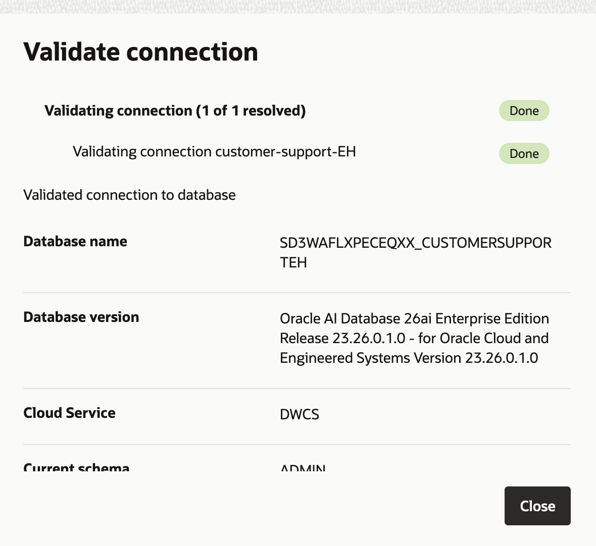

### 2. GenAI Agents 생성
- 전체 솔루션을 구동할 GenAI Agent를 만들어 보겠습니다. 두가지 툴을 활용합니다.
- RAG 도구: 사용자가 해당 정보를 필요로 할 때마다 객체 스토리지에 업로드된 지식 문서를 검색합니다.
- SQL 도구: 티켓팅 시스템과 관련하여 ADB 인스턴스에 저장된 정보를 검색할 수 있습니다.
- 메뉴 > Analytics & AI > AI Services > Generative AI Agents를 클릭합니다.
- 'Create agent'버튼을 클릭합니다.
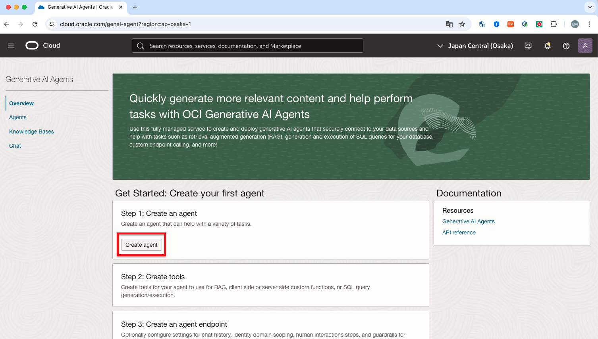
```
Name: customer support agent
Compartment: 본인 컴파트먼트 선택
Description: 이 에이전트는 support 담당자의 업무를 간소화하는 데 도움을 드립니다.
Welcome message: 안녕하세요! 저는 고객 지원 도우미입니다. 무엇을 도와드릴까요?
```
- 'Next'버튼을 클릭합니다.
- 'Add tool'버튼을 클릭합니다. 
```
Type: RAG
Name: Knowledge base articles
Description: 이 도구는 고객 지원 담당자가 SR을 해결하기 위해 문제 해결 정보가 필요할 때마다 지식 기반 지원 문서를 검색합니다.
Custom instructions(에이전트 response에 대한 가이드 지침 전달): 존댓말을 사용하고, Tool 안에 있는 내용만을 기반으로 대답합니다. 
```
***! Custom Instructions에는 LLM에 전달할 프롬프트를 입력함***
- Add Knowledge bases > Comapartment: 개인 컴파트먼트 선택
- 'Create knowledge base' 버튼을 클릭합니다.
```
Name: Customer support knowledge base articles
Compartment: 개인 컴파트먼트 선택
Data store type: Object storage
Enable hybrid search를 체크하여 진행
```
***! Hybrid Serach = lexical + Symantic Search를 조합한 것.완전히 일치 하는 것 + 벡터 검색을 통한 유사도 검색을 조합하여 진행하는 것을 의미***
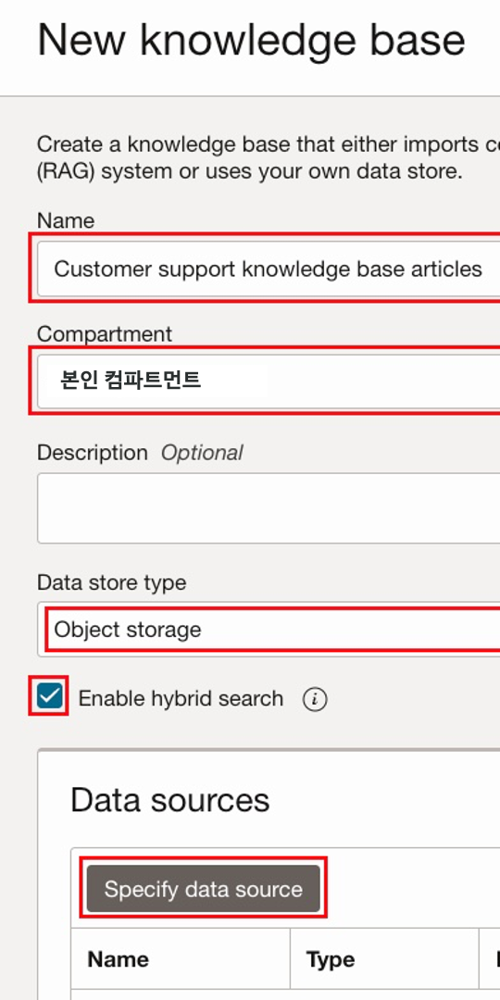
- Specify data source를 클릭합니다.
```
Name: Knowledge base articles
```
***! Enable mult-modal parsing은 체크하지 않고 진행합니다. 이 옵션은 차트 및 그래픽을 포함하고 있는 컨텐츠 분석을 활용하여 답변을 생성할 수 있도록 합니다. 이미지, 차트, 그래픽 요소가 문서 내에 있는 경우에는 체크하여 더욱 정확한 답변을 할 수 있습니다. 하지만 이번 실습예제에는 pdf파일 내에 그래픽이 없으므로 체크하지 않겠습니다. multi-modality 분석을 활성화하면 성능이 느려질 수 있는 가능성이 있기 때문입니다.***
- 이어서 Data bucket 부분입니다.
```
bucket: knowledge-base-EH (1-2에서 생성해둔 bucket)
select all in bucket을 체크하여, 업로드한 8개의 문서를 모두 참조하도록 설정
```
- 'Create' 버튼을 클릭합니다.
- 'Automatically start ingestion job for above data source'옵션이 선택되어 있는지 확인하세요. 처음 생성 시, 모든 파일을 자동으로 수집하도록 작업 job이 생성됩니다. 나중에 bucket에서 정보를 다시 수집하려면 수동으로 해당 작업을 트리거해야합니다.
- 'Create' 버튼을 클릭합니다.
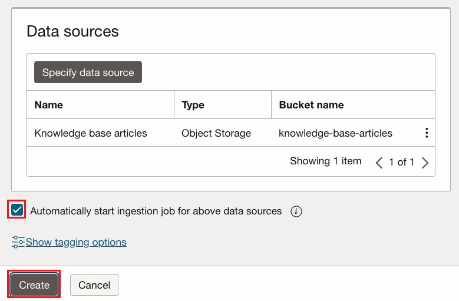
- Job이 완료 되면, Knowledge base 옆에 체크박스가 선택되어 있는지 확인 후, 'Create' 버튼을 클릭합니다.
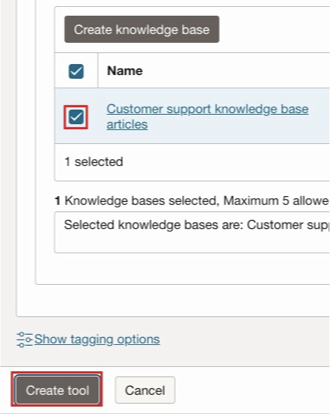
- RAG 툴 Configuration이 끝났고, 이제 SQL 툴을 구성해 보겠습니다. 'Add tool' 버튼을 클릭합니다.
```
Type: SQL
Name: customer support database
Description: DB에는 고객이 생성한 SR과 해당 SR을 처리하는 고객 지원 담당자, 이슈를 제기한 고객에 대한 정보가 포함되어 있습니다.
```
- Schema and metadata 파트에서 스키마 Config 부분을 'Inline'으로 선택 후, 아래의 Database Schema를 복사하여 입력합니다.
```sql
CREATE TABLE Customers (
   CustomerID NUMBER PRIMARY KEY,
   FirstName VARCHAR2(50) NOT NULL,
   LastName VARCHAR2(50) NOT NULL,
   Email VARCHAR2(100) UNIQUE NOT NULL,
   Phone VARCHAR2(20),
   Address VARCHAR2(200)
);

CREATE TABLE SupportAgents (
   AgentID NUMBER PRIMARY KEY,
   FirstName VARCHAR2(50) NOT NULL,
   LastName VARCHAR2(50) NOT NULL,
   Email VARCHAR2(100) UNIQUE NOT NULL,
   Phone VARCHAR2(20)
);

CREATE TABLE TicketStatus (
   StatusID NUMBER PRIMARY KEY,
   StatusName VARCHAR2(50) NOT NULL
);

CREATE TABLE Tickets (
   TicketID NUMBER PRIMARY KEY,
   CustomerID NUMBER NOT NULL,
   Subject VARCHAR2(200) NOT NULL,
   Description CLOB NOT NULL,
   CreatedDate DATE DEFAULT SYSTIMESTAMP NOT NULL,
   LastUpdatedDate DATE DEFAULT SYSTIMESTAMP NOT NULL,
   StatusID NUMBER NOT NULL,
   AssignedToAgentID NUMBER,
   FOREIGN KEY (CustomerID) REFERENCES Customers(CustomerID),
   FOREIGN KEY (StatusID) REFERENCES TicketStatus(StatusID),
   FOREIGN KEY (AssignedToAgentID) REFERENCES SupportAgents(AgentID)
);
```
- Description of tables and columns: inline으로 선택 후, 테이블과 column에 대한 정보를 아래와 같이 입력해 줍니다.
```
Customers table - 이 테이블의 각 레코드는 고객에 대한 정보를 포함하며, 고객이 지원 티켓을 생성했을 수도, 생성하지 않았을 수도 있습니다.
Columns:
CustomerID - 숫자, 고객을 위한 고유 식별자
FirstName - 문자열, 고객의 이름
LastName - 문자열, 고객의 성
Email - 문자열, 소통을 위한 고객의 이메일 주소
Phone - 문자열, 소통을 위한 고객의 전화번호
Address - 문자열, 소통을 위한 고객의 주소

SupportAgents table - 이 테이블의 각 레코드는 지원 티켓을 처리하는 지원 담당자에 대한 정보를 포함합니다.
Columns:
AgentID - 숫자, 지원 담당자를 위한 고유 식별자
FirstName - 문자열, 지원 담당자의 이름
LastName - 문자열, 지원 담당자의 성
Email - 문자열, 지원 담당자의 업무용 이메일 주소
Phone - 문자열, 지원 담당자의 업무용 전화번호

TicketStatus table - 지원 티켓이 가질 수 있는 여러 상태 목록을 포함하고 있습니다.
Columns:
StatusID - 숫자, 상태를 위한 고유 식별자
StatusName - 문자열, 상태에 할당된 이름
가능한 상태 이름은 다음과 같습니다:
New - 지원 티켓이 생성된 직후, 분류 전 상태
Open - 지원 티켓이 분류되고 지원 담당자에게 할당된 상태
In Progress - 지원 담당자가 이슈 처리를 시작한 상태
On Hold - 외부 요인이나 다른 이슈로 인해 처리 지연 상태인 경우
Resolved - 고객이 만족할 만큼 이슈가 성공적으로 해결된 상태
Closed - 고객이 이슈가 해결되었음을 인정한 상태
Escalated - 지원 담당자가 문제를 해결하지 못했거나, 이슈가 3일 이상 지속된 경우 상위로 이관된 상태
Cancelled - 고객이 이슈가 해결됐다고 알렸으나, 지원 담당자가 별도의 조치를 하지 않은 상태

Tickets table - 이 테이블의 각 레코드는 고객이 보고한 이슈에 대한 정보를 포함하며, 이슈의 세부 정보와 현재 상태, 처리 담당 지원 담당자 정보를 함께 가집니다.
Columns:
TicketID - 숫자, 티켓의 고유 식별자
CustomerID - 숫자, 이슈를 보고한 고객을 나타내는 Customers table의 고객 ID
Subject - 문자열, 이슈에 대한 짧은 설명
Description - 문자열, 이슈를 이해하고 해결하는 데 필요한 모든 정보를 포함하는 상세 설명
CreatedDate - 날짜/시간, 고객이 티켓을 생성한 날짜와 시간
LastUpdatedDate - 날짜/시간, 지원 담당자가 해당 티켓에 대해 마지막 조치를 한 날짜와 시간
StatusID - 숫자, 티켓의 현재 상태를 나타내는 TicketStatus table의 상태 ID
AssignedToAgentID - 숫자, 이 이슈를 처리하도록 할당된 지원 담당자를 나타내는 SupportAgents table의 지원 담당자 ID
```
- Model customization: Small(faster response)로 선택합니다.
- Dialect: Oracle SQL로 선택합니다.
- Database tool connection: customer-support-EH(앞서 생성해둔 DB 선택)
- Test connection을 클릭하여 접속여부를 확인합니다.
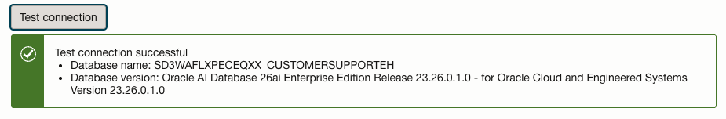
- SQL 실행 옵션, Self correction 옵션을 모두 활성화 합니다. 
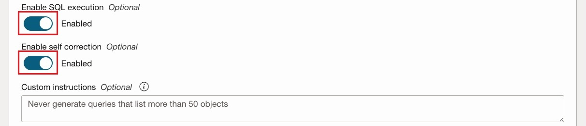
***! SQL 실행 옵션: Tool이 사용자 요청에 따라 생성된 SQL 쿼리를 실행하도록 지시 합니다. 이를 통해 에이전트는 쿼리에서 반환된 데이터를 기반으로 지능적인 응답을 작성할 수 있습니다.
Self Correction 옵션: Tool이 생성된 SQL 쿼리의 구문 오류를 자동으로 감지하고 수정할 수 있습니다.***

- 'Add tool'버튼을 클릭합니다. Tool이 모두 추가 되었으면, 'Next'버튼을 클릭합니다.
- Setup agent endpoint 섹션에서, Automatically create an endpoint for this agent를 체크하고, Enable human in the loop 옵션도 활성화 합니다.

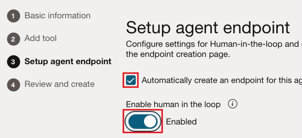

***! Human in the loop 옵션은 에이전트가 생성한 답변을 실제로 사용하기 전에, 사람이 이를 확인(승인)해야 하는지 여부를 설정합니다.***

- 가드레일을 설정합니다. 
- Contents Moderation(내용 검열)
    - 입력값(사용자 프롬프트), 출력값(생성된 응답) 또는 둘 다에 대해 적용 가능합니다.
    - 비활성화(Disable): 콘텐츠 모더레이션을 적용하지 않음
    - 차단(Block): 콘텐츠 모더레이션을 적용하여 부적절한 내용을 식별 및 차단
    - 알림(Inform): 콘텐츠 모더레이션은 적용하지 않지만, 검열이 필요한 내용이 감지되면 사용자에게 알림
- 프롬프트 인젝션(PI, Prompt Injection) 보호
    - 비활성화(Disable): PI 보호를 적용하지 않음
    - 차단(Block): 프롬프트 인젝션 공격을 식별하고 방지
    - 알림(Inform): 보호는 적용하지 않지만, 위험이 감지되면 사용자에게 알림
- 개인 식별 정보(PII) 보호
    - 입력값(사용자 프롬프트), 출력값(생성된 응답) 또는 둘 다에 대해 적용 가능
    - 비활성화(Disable): PII 보호를 적용하지 않음
    - 차단(Block): PII(개인 식별 정보)를 식별하고 보호
    - 알림(Inform): 보호는 적용하지 않지만, PII가 감지되면 사용자에게 알림

- 데모에서는 우선 모두 Disable로 두고 진행 하겠습니다.
- 'Next'를 클릭합니다. 'Create agent'를 클릭합니다.
- License 알람이 뜨면, 체크박스에 체크하고 'Submit' 버튼을 클릭합니다. 
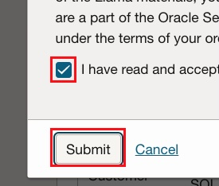
- 생성이 완료될 때까지 기다립니다. 

### 3. GenAI Agents 테스트
- GenAI Agents 생성이 완료 되었으면, Agents 상세 페이지로 이동합니다.
- 'Launch chat'버튼을 클릭합니다.
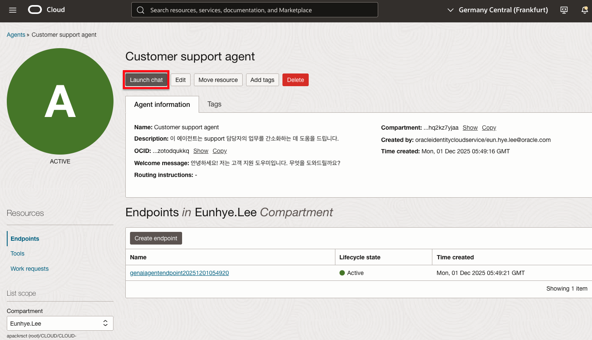

- 질문: 시스템에 몇개의 Ticket이 있나요?
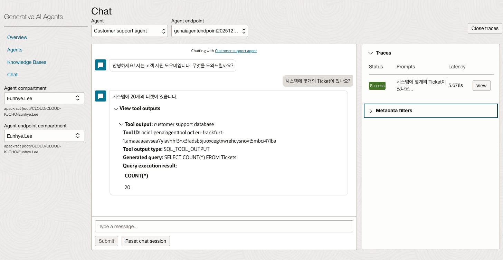
- Planning & Tool Select & Citation 등을 확인할 수 있습니다.


- 질문: 지금 제일 바쁜 서포트 에이전트는 누구야?
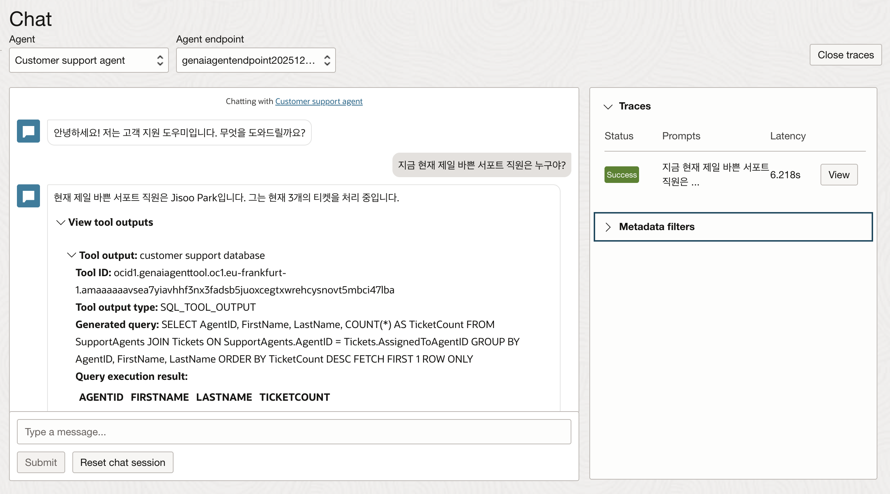


- 질문: Jisoo Park에게 할당된 티켓의 title과 Description 보여줄 수 있어? 

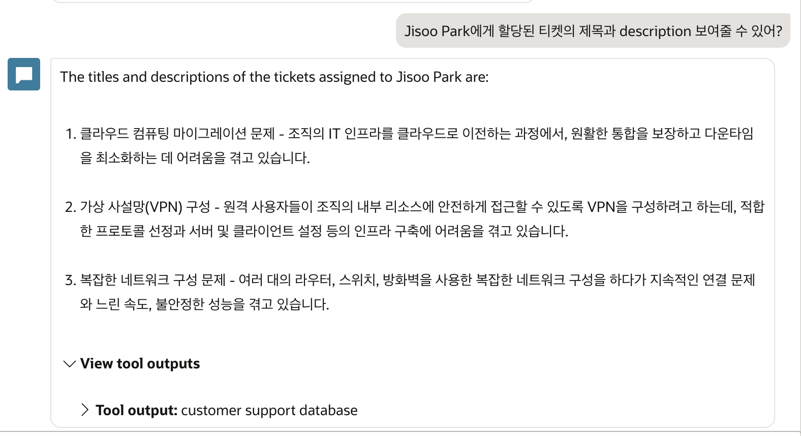
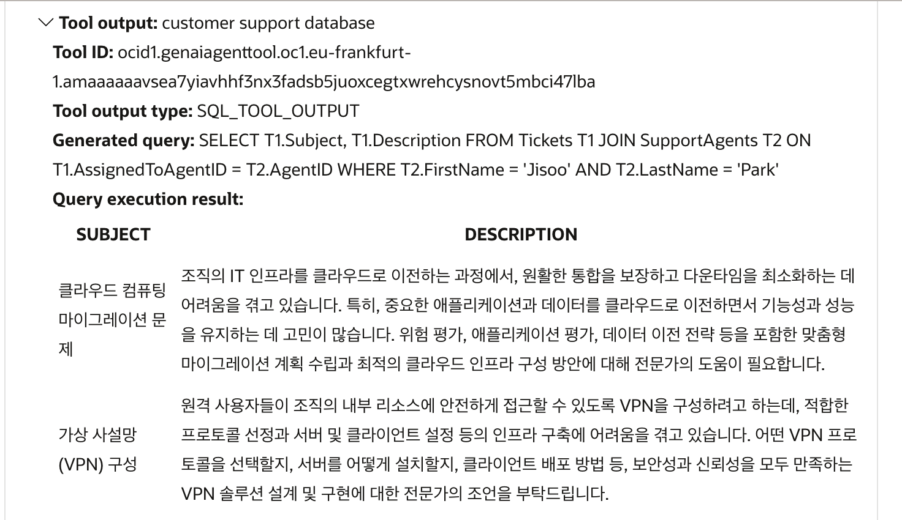


- 질문: Do we have a knowledge article which can help resolve the "Complex Network Configuration Issue" ticket?

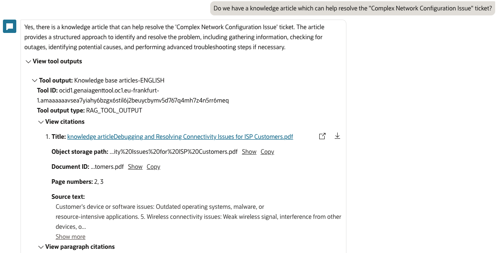

- 같은 질문을 해도, 답변의 편차가 큼.
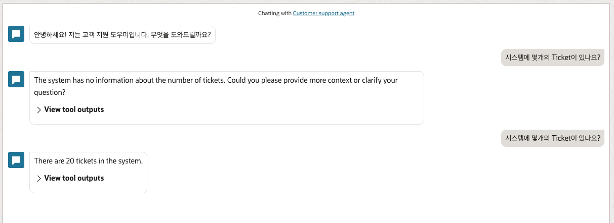

