  # 1. Hands-on 시나리오: 통신사 고객 이탈 예측

  본 시나리오는 통신사의 고객 이탈(Churn)을 예측하고, 고객 리뷰 기반 감성 분석을 결합하여 보다 정확한 예측과 인사이트를 도출하는 전체 데이터 파이프라인을 설명합니다.  
  전체 구성은 **Bronze–Silver–Gold의 Medallion 아키텍처**를 기반으로 합니다.

  ---

  # 목차

1. [Hands-on 시나리오 개요](#1-hands-on-시나리오-통신사-고객-이탈-예측)  
2. [전체 Medallion 아키텍처 요약](#2-전체-medallion-아키텍처-요약)  
3. [고객 이탈 예측 (Churn Prediction)](#3-고객-이탈-예측-churn-prediction)  
   - [입력 데이터](#31-입력-데이터)  
   - [처리 단계](#32-처리-단계)  
4. [통신사 감성 분석 (Sentiment Analysis)](#4-통신사-감성-분석-sentiment-analysis)  
   - [입력 데이터](#41-입력-데이터)  
   - [처리 단계](#42-처리-단계)  
5. [Oracle Analytics Cloud 활용](#5-oracle-analytics-cloud-활용)  
6. [Scenario Diagram](#6-scenario-diagram)  
7. [Prerequisites](#7-prerequisites)  
   - [미리 생성해야 하는 리소스](#71-미리-생성해야-하는-리소스들)  
   - [Resources](#72-resources)  
8. [AI Data Platform Hands-on](#8-ai-data-platform-hands-on)  
   - [Catalog 및 Volume 구성](#81-step-1-catalog-생성)  
   - [Spark Compute 및 Notebook 준비](#87-step-7-aidp-spark-compute-클러스터-생성)  
   - [01/02/03 노트북 개요](#89-step-9-notebook-실행-및-01번-노트북-개요)

  ---

  ## 2. 전체 Medallion 아키텍처 요약

  | 단계 | 주요 작업 |
  |------|-----------|
  | **Bronze** | 원본 데이터 적재 (이탈 이력, 고객 데이터, 리뷰 데이터) |
  | **Silver** | 데이터 정제, ML/GenAI 기반 모델 수행 |
  | **Gold** | 예측/분석 결과 저장, Oracle Analytics Cloud(OAC) 시각화·분석 |

  ---

  ## 3. 고객 이탈 예측 (Churn Prediction)

> **이번 Hands-on 실습에서는 본 시나리오의 1~2번 단계까지(브론즈 → 실버 → 골드 기반의 고객 이탈 예측)만 진행합니다.**  
> **4번(감성 분석)과 5번(OAC 분석 활용)은 추가 학습이 필요한 선택 단계이며, 원하시는 분께는 별도 자료를 제공해 드립니다.**

  ### 3.1 입력 데이터
  - 고객 이탈 이력 데이터  
  - 현재 고객 데이터  

  ### 3.2 처리 단계

  #### Bronze Layer
  - 고객 이탈 이력 데이터 적재  
  - 현재 고객 데이터 적재  

  #### Silver Layer
  - 이탈 이력 데이터 정제  
  - 현재 고객 기반 데이터 정제  
  - 정제된 데이터를 활용한 ML 모델 학습 (Churn Prediction Model)

  #### Gold Layer
  - 학습된 ML 모델을 적용하여 고객 이탈 예측 수행  
  - 예측 결과 저장 및 분석 가능한 형태로 가공  

  ---

  ## 4. 통신사 감성 분석 (Sentiment Analysis)

  ### 4.1 입력 데이터
  - 고객 리뷰 데이터  

  ### 4.2 처리 단계

  #### Bronze Layer
  - 고객 리뷰 원본 데이터 적재  

  #### Silver Layer
  - 리뷰 데이터 정제  
  - GenAI 모델 기반 감성 분석 수행  

  #### Gold Layer
  - 감성 분석 결과 저장  
  - 분석용 결과 데이터셋 구성  

  ---

  ## 5. Oracle Analytics Cloud 활용

  - Gold Layer에 저장된 고객 이탈 예측 결과와 감성 분석 결과는 Oracle Analytics Cloud(OAC)에서 시각화 및 분석이 가능합니다.
  - 이를 통해 다음과 같은 통합 분석이 가능합니다.  
    예: “이탈 가능성이 높은 고객 중 부정적 리뷰를 남긴 고객은 누구인가?”

  ---

  ## 6. Scenario Diagram

  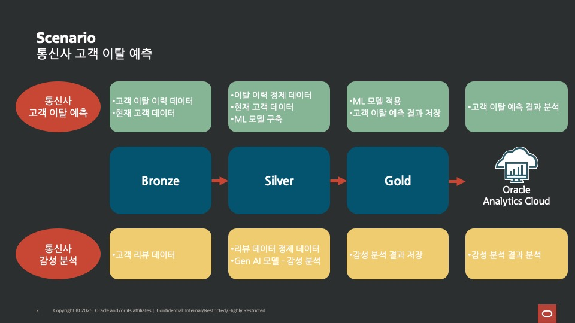

  ---

  # 7. Prerequisites

  ## 7.1 미리 생성해야 하는 리소스들
  - 컴파트먼트
  - AI Lakehouse
  - Object Storage

  ## 7.2 Resources

  ### 7.2.1 Step 1: Region 및 Object Storage 버킷 화면 확인

  Oracle Cloud 콘솔에서 이후 실습에 사용할 Region과 Object Storage 버킷을 확인합니다.

  - 화면 오른쪽 상단에서 Region이 **US Midwest (Chicago)** 로 설정되어 있는지 확인합니다.  
  - 왼쪽 메뉴에서 **Storage → Object Storage & Archive Storage → Buckets** 화면으로 이동합니다.  
  - 상단의 Compartment가 본인 실습용 Compartment(예: `MINJI.KIM`)로 설정되어 있는지 확인합니다.  
  - 실습에 사용할 버킷들(예: `AIDP-MINJIKIM`)을 생성합니다.  
  - 생성이 완료되면 Buckets 목록에 정상적으로 표시되는지 확인합니다.

  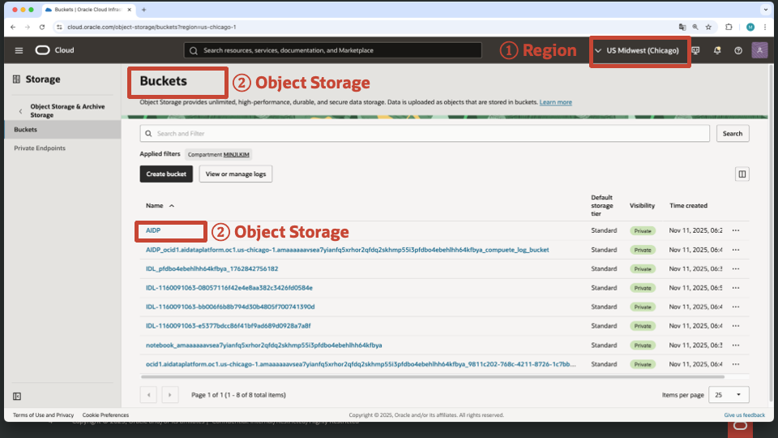

  ---
### 7.2.2 Step 2: AI Lakehouse(AI Autonomous Database) 확인

Oracle Cloud 콘솔에서 실습에 사용할 AI Lakehouse(AIDP-ADB)가 정상적으로 생성되어 있는지 확인합니다.

- Region이 **US Midwest (Chicago)** 로 설정되어 있는지 다시 한 번 확인합니다.  
- 좌측 메뉴에서 **Oracle AI Database → Autonomous AI Database** 로 이동합니다.  
- Compartment가 실습용 Compartment(예: `MINJI.KIM`)로 설정되어 있는지 확인합니다.  
- Display name을 예: `AIDP-ADB-MINJIKIM` 로 입력하여 AI Lakehouse 인스턴스를 생성합니다.  
- 생성이 완료되면 인스턴스가 목록에 표시되어야 하며  
  - 상태(State)는 `Available`  
  - Workload type은 `Lakehouse`  
  로 설정되어 있는지 확인합니다.

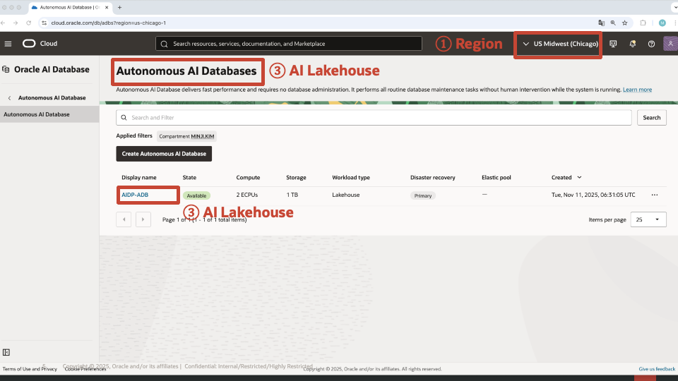

---

### 7.2.3 Step 3: AI Lakehouse에 IDL 스키마 생성 및 확인

AI Lakehouse(AIDP-ADB) 환경에서 실습에 사용할 **IDL 스키마(Schema)** 를 직접 생성하고,  
생성이 정상적으로 완료되었는지 SQL Worksheet에서 확인합니다.

1. Oracle Database Actions(SQL) 화면으로 이동합니다.  
2. SQL Worksheet에서 다음 명령을 실행하여 **IDL 스키마를 생성**합니다.

   ```sql
   CREATE USER IDL IDENTIFIED BY "<패스워드>";
   GRANT CONNECT, RESOURCE TO IDL;
   ALTER USER IDL QUOTA UNLIMITED ON DATA;
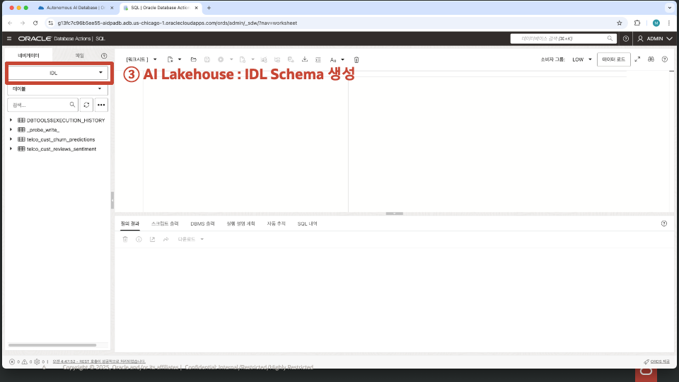

---

### 7.2.4 Step 4: AIDP 생성 메뉴로 이동 (Analytics & AI → AI Data Platform)

Oracle Cloud 콘솔에서 AI Data Platform(AIDP)을 생성하기 위해 해당 서비스 메뉴로 이동합니다.

1. 좌측 메뉴에서 **Analytics & AI** 항목을 선택합니다.  
2. **Data Lake** 카테고리 아래에서 **AI Data Platform** 메뉴를 클릭합니다.  
   - 이 메뉴에서 새로운 AIDP 인스턴스를 생성할 수 있습니다.

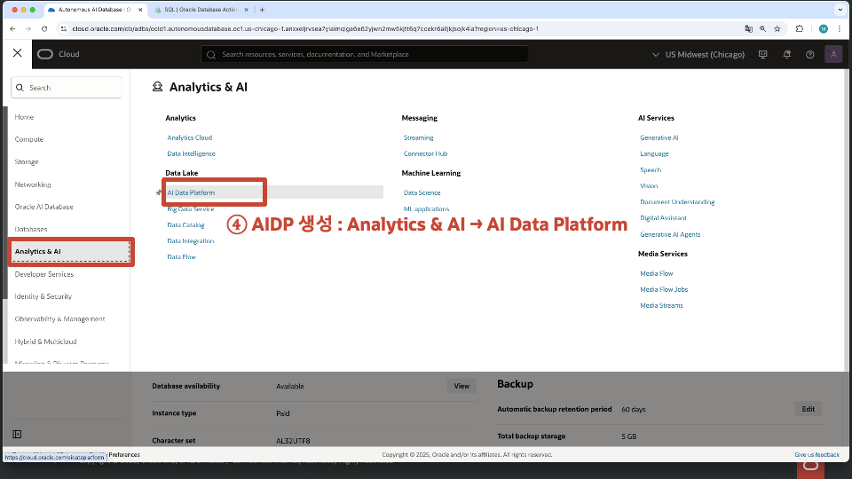

---

### 7.2.5 Step 5: AI Data Platform 생성 시작

AIDP(AI Data Platform)를 새로 생성하기 위해 생성 화면으로 이동합니다.

1. **Compartment**가 실습용 Compartment(예: `MINJI.KIM`)로 설정되어 있는지 확인합니다.  
2. AI Data Platform 목록 화면에서 **Create AI Data Platform** 버튼을 클릭합니다.  
   - 이 버튼을 클릭하면 새로운 AIDP 인스턴스를 구성하는 입력 화면으로 이동합니다.

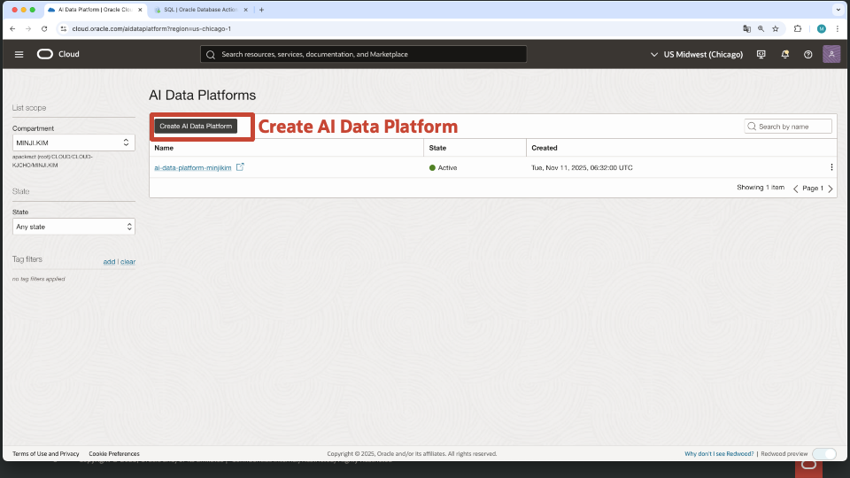

---

### 7.2.6 Step 6: AI Data Platform 정보 입력 및 생성(Create)

AIDP 생성 화면에서 필요한 기본 정보를 입력한 뒤 플랫폼을 생성합니다.

1. **AI Data Platform name**  
   - 실습용으로 본인 이름이나 구분자를 포함하여 입력합니다.  
   - 예: `ai-data-platform-minjkim`  

2. **Workspace name**  
   - 기본 워크스페이스 이름도 동일하게 본인 구분자를 포함해 입력합니다.  
   - 예: `ai-data-platform-minjkim`  

3. **Choose access level**  
   - Access level 드롭다운에서 **Standard**를 선택합니다.  
   - 테넌시에서 권장되는 기본 접근 정책을 자동으로 적용합니다.

4. 모든 정보 입력 후 **Create** 버튼을 클릭하여 AIDP 인스턴스를 생성합니다.

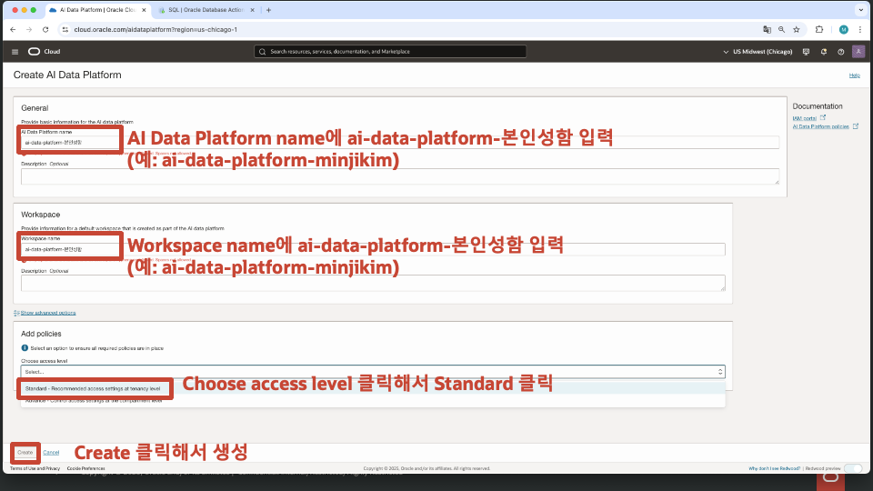

---
# 8. AI Data Platform Hands-on

이제부터는 생성한 AI Data Platform(AIDP) 환경에서  
데이터를 **수집(ingest) → 정제(transform) → 분석·예측(analyze/model)** 하는 전체 실습을 진행합니다.

본격적인 Hands-on에 들어가기 전에, AIDP가 어떤 플랫폼이고 어떻게 사용하는지 간단히 살펴보겠습니다.

---

## Oracle AI Data Platform(AIDP) 간단 소개

Oracle AI Data Platform(AIDP)은 기업이 데이터를 활용하는 전 과정 —  **저장 → 관리 → 분석 → AI/ML 모델링** — 을  
한 곳에서 수행할 수 있도록 만든 통합 데이터 플랫폼입니다.

즉,

- 데이터를 담는 **저장소**,  
- 데이터를 다루는 **데이터 엔지니어링·분석 환경**,  
- 모델을 개발·실행하는 **AI/ML 공간**,  
- 여러 팀이 함께 사용하는 **협업·거버넌스 체계**

이 네 가지 기능을 **하나로 묶어 제공하는 현대적 데이터 레이크하우스 기반 플랫폼**입니다.

---

## 🔹 AIDP로 무엇을 할 수 있을까?

### ✔ 1) Medallion Architecture (Bronze → Silver → Gold)
- Bronze: 원본 데이터 적재  
- Silver: 정제 및 표준화  
- Gold: 분석·예측 결과 저장  
- Delta Lake/Iceberg 기반 고신뢰 데이터 레이어 생성

---

### ✔ 2) ETL & 대규모 데이터 엔지니어링
- Spark 기반 워크플로 자동화  
- 대용량 배치 처리 및 데이터 변환  
- 실시간 데이터 파이프라인도 확장 가능

---

### ✔ 3) AI/ML 모델 개발 및 실행
- Spark Notebook에서 직접 모델 학습 및 테스트  
- 대규모 Feature Engineering  
- Python / PySpark 환경 제공

---

### ✔ 4) 기업 데이터 카탈로그 & 거버넌스
- 모든 데이터 자산을 **Master Catalog**에서 통합 관리  
- RBAC 기반 권한 제어  
- Autonomous Database(ADB) 등 외부 카탈로그까지 연동  
- Delta Sharing 기반 안전한 데이터 공유

---

### ✔ 5) Analytics & BI 연계
- JDBC로 OAC, Tableau, Power BI 등과 자연스럽게 연결  
- 데이터 준비 → 분석 → 시각화까지 단일 플랫폼에서 완성

---

### ✔ 6) Multi-Cloud / Hybrid 분석
- 외부 스토리지·타 클라우드 연동  
- 데이터 복제 없이 **Zero-copy 분석**  
- 규제·데이터 주권 요구사항 충족

---

## 📌 AIDP Hands-on에 앞서: 콘솔 화면 구조 이해하기

Hands-on 단계에서는 AIDP 콘솔의 다양한 메뉴를 사용하게 됩니다.  
먼저 **AIDP Workspace와 주요 UI 구성 요소**를 간단히 이해하고 가면 이후 실습이 훨씬 자연스럽습니다.

## 🔸 AIDP 좌측 네비게이션 메뉴 구성

AIDP 내부의 왼쪽 사이드바에는 다음과 같은 주요 메뉴가 있습니다.

### **① Home**
- AIDP의 메인 대시보드로 이동  
- 최근 작업, 리소스 요약 등을 확인할 수 있음

### **② Master Catalog**
- 워크스페이스에 등록된 **모든 데이터 자산(테이블, 볼륨, 스키마)** 조회  
- 외부 카탈로그(ADB, Object Storage 등) 메타데이터도 통합 관리

### **③ Workspace**
- 현재 선택된 워크스페이스의 세부 기능으로 이동

#### Workspace 내부 메뉴
| 메뉴 | 설명 |
|------|------|
| **Workflow** | Spark 기반 데이터 파이프라인을 설계·스케줄링 |
| **Compute** | Notebook 실행 및 작업용 Spark 클러스터 관리 |
| **Data Sharing** | Delta Sharing 기반 외부 서비스와의 데이터 공유 |
| **Auto Populate Catalog** | 연결된 소스에서 자동으로 메타데이터 수집 |
| **Notifications** | 시스템 메시지 및 경고 확인 |
| **Roles** | RBAC 기반 사용자/역할 권한 설정 |
| **Audit logs** | 작업 이력 및 객체 변경 이력 조회 |

### **④ Select Workspace**
- 여러 워크스페이스를 사용하는 경우 쉽게 전환 가능

---

이제 콘솔 구성을 이해했으므로,  
실제로 데이터를 저장할 첫 번째 리소스인 **Catalog 생성**부터 Hands-on을 시작하겠습니다.

---

## 8.1 Step 1: Catalog 생성

AIDP에서 데이터를 관리하기 위해서는 먼저 **Catalog**를 생성해야 합니다.  
Catalog는 테이블, 볼륨, 스키마 등 AIDP의 모든 데이터 자산을 저장·조직화하는 기본 단위입니다.

1. AIDP 콘솔에 접속합니다.  
2. 좌측 상단의 **Create** 버튼을 클릭합니다.  
3. 드롭다운 메뉴에서 **Catalog** 를 선택합니다.

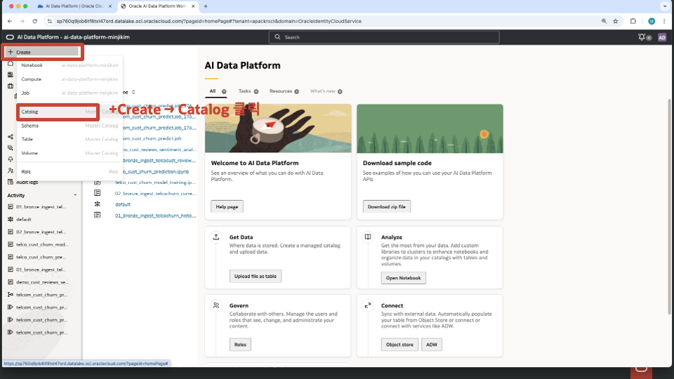

---


## 8.2 Step 2: Catalog 생성 정보 입력

Catalog 생성을 위해 필요한 정보를 입력합니다.  
이 Catalog는 이후 Bronze/Silver/Gold 레이어의 데이터 자산을 관리하는 기본 저장소로 사용됩니다.

1. **Catalog name** 입력  
   - 실습 목적에 맞는 이름을 입력합니다.  
   - 예: `demo_telco_churn_bronze`

2. **Catalog type** 선택  
   - 기본값인 **Standard catalog** 를 선택합니다.

3. **Compartment** 선택  
   - 실습용 Compartment(예: `MINJI.KIM`)로 설정합니다.

4. 모든 정보를 입력한 후 **Create** 버튼을 클릭하여 Catalog를 생성합니다.

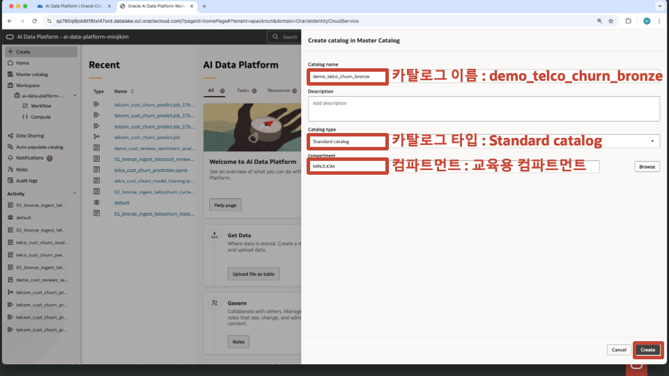

---
## 8.3 Step 3: Bronze / Silver / Gold용 Catalog 생성 완료 확인

앞 단계(8.1, 8.2)와 동일한 절차로 총 **3개의 Catalog**를 생성하여 Medallion 아키텍처 구조(Bronze → Silver → Gold)를 구성합니다.

생성해야 하는 Catalog는 다음과 같습니다.

- `demo_telco_churn_bronze`  
- `demo_telco_churn_silver`  
- `demo_telco_churn_gold`

Catalog 생성이 완료되면 **Master Catalog** 화면에서 세 가지 Catalog가 모두 *Active* 상태로 표시되어야 합니다.

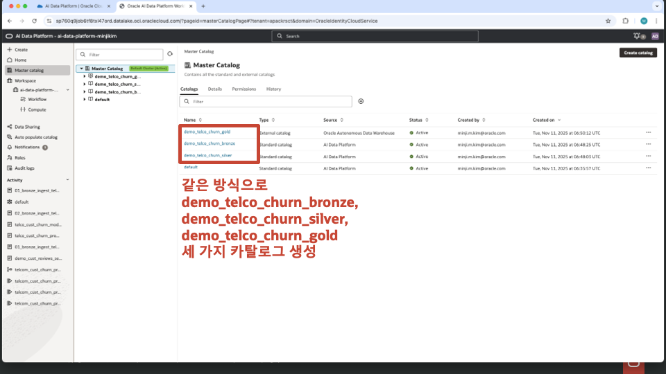

---
## 8.4 Step 4: Bronze Catalog 내에 Schema 생성

Bronze 계층에서 사용할 데이터를 저장하기 위해 `demo_telco_churn_bronze` Catalog 안에 스키마(Schema)를 생성합니다.

1. 좌측 메뉴에서 **Master catalog → demo_telco_churn_bronze** 를 클릭합니다.  
2. 상단의 **Schemas** 탭에서 **+ (Create schema)** 버튼을 클릭합니다.  
3. Schema Name을 입력합니다.  
   - 예: `telco_churn_historical`  
   - 이 스키마는 Bronze 단계에서 원본 Telco Churn 데이터를 저장하는 용도로 사용됩니다.
4. 입력 후 **Create** 버튼을 클릭하여 스키마를 생성합니다.

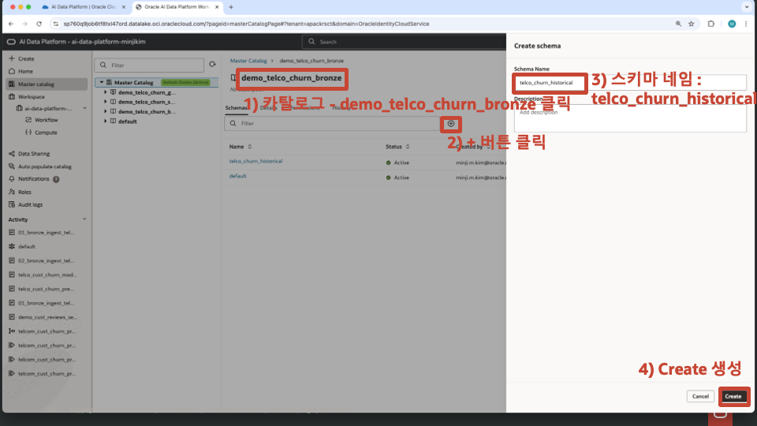

---
## 8.5 Step 5: Silver Catalog에 동일한 Schema 생성

Bronze Catalog와 마찬가지로 Silver Catalog에도 동일한 스키마(`telco_churn_historical`)를 생성합니다.  

1. 좌측 메뉴에서 **Master catalog → demo_telco_churn_silver** 를 선택합니다.  
2. **Schemas** 탭에서 스키마 목록을 확인한 뒤 필요 시 **Create schema** 버튼을 클릭합니다.  
3. Schema Name을 입력합니다.  
   - 예: `telco_churn_historical`  
4. 생성된 스키마가 **Active** 상태로 표시되면 Silver Catalog 구성이 완료됩니다.

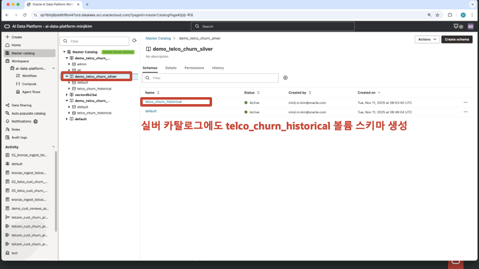

---
## 8.6 Step 6: Bronze Catalog에 External Volume 생성 및 CSV 파일 확인

Bronze 단계에서 원본 데이터를 불러오기 위해 Object Storage 버킷을 **External Volume** 형태로 Catalog에 연결합니다.

### 1) Bronze Catalog의 Schema로 이동
- 좌측 메뉴에서  
  **Master catalog → demo_telco_churn_bronze → telco_churn_historical**  
  스키마를 선택합니다.
- 상단 탭에서 **Volumes** 를 클릭합니다.

### 2) External Volume 생성
1. Volumes 화면에서 **+ (Create volume)** 버튼을 클릭합니다.  
2. Volume 정보를 입력합니다.  
   - **Volume name**: `bronze_telco_churn_historical`  
   - **Volume type**: *External*  
   - **Compartment**: 실습용 Compartment(예: `MINJI.KIM`)  
   - **Bucket**: 앞서 생성한 Object Storage 버킷(AIDP 또는 개인 버킷) 선택  
3. 입력이 완료되면 **Create** 버튼을 클릭합니다.

### 3) 생성된 Volume의 파일 목록 확인
- 생성된 Volume을 클릭하면 버킷 내 파일들이 표시됩니다.  
- 아래와 같이 원본 데이터 CSV 3개가 확인되어야 합니다.
  - `TelcoCustomerChurnHistorical.csv`  
  - `TelcoCustomerBase.csv`  
  - `telecom_reviews.csv`

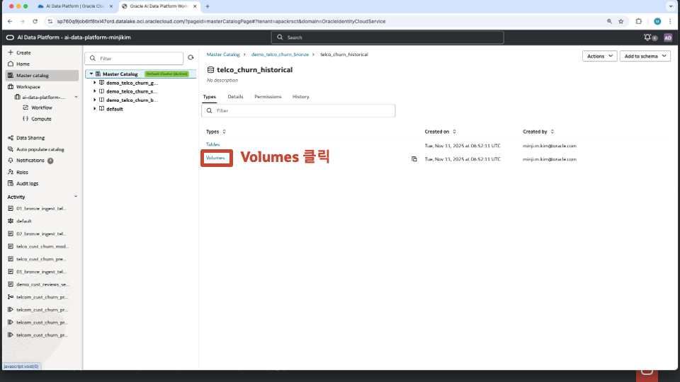
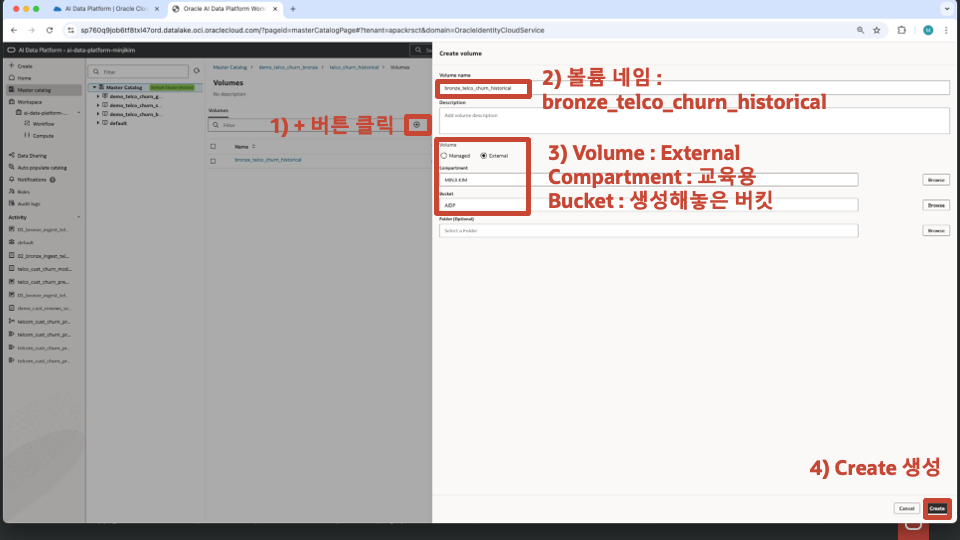
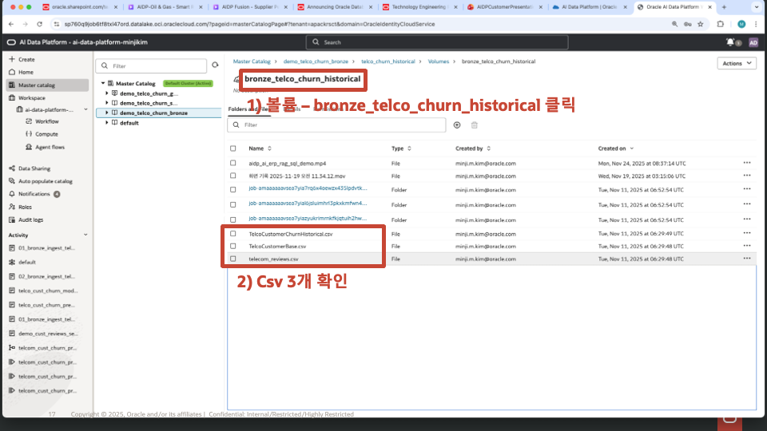

---
## 8.7 Step 7: AIDP Spark Compute 클러스터 생성

Bronze/Silver/Gold 처리 작업과 Notebook 실행을 위해 AI Data Platform에서 Spark 기반 Compute 클러스터를 생성합니다.

### 1) Compute 메뉴로 이동
- 좌측 메뉴에서 **Workspace → (실습 워크스페이스명) → Compute** 를 클릭합니다.

### 2) 새 클러스터 생성
- 우측 상단의 **+ (Create cluster)** 버튼을 클릭합니다.

### 3) 클러스터 정보 입력
- **Cluster name**: `notebook` (Notebook 실행용으로 사용)

### 4) Runtime 및 클러스터 설정
- **Runtime version**: Spark 3.5.0 (기본값 유지)  
- **Cluster configuration**: *Quickstart* 선택 (기본 설정 사용)  
- **Autoscale**: 기본 활성화 상태 유지  
- **Idle timeout**: 기본값 120분 유지  

대부분의 실습에서는 기본 설정으로 충분하며, 추가 조정을 필요로 하지 않습니다.

### 5) 클러스터 생성
- 화면 하단의 **Create** 버튼을 클릭합니다.  
- 클러스터 상태가 **Active** 로 바뀌면 Notebook에서 사용할 수 있습니다.


---
## 8.8 Step 8: 실습용 Notebook 파일 업로드

AI Data Platform Workspace에 제공된 실습 Notebook 3개를 업로드합니다.  
업로드된 Notebook은 이후 Bronze → Silver → Gold 순서의 Hands-on 실습에서 실행됩니다.

### 1) Workspace 선택
- 좌측 메뉴에서 **Workspace → (실습 워크스페이스명)** 을 클릭합니다.  
  예: `ai-data-platform-minjkim`

### 2) Notebook 업로드 버튼 클릭
- 우측 상단의 **Upload** 아이콘을 클릭합니다.

### 3) 업로드할 Notebook 파일 선택
다음 3개 파일을 선택하여 업로드합니다.

- `01_bronze_ingest_telcochurn_history.ipynb`  
- `02_telco_cust_churn_model_training.ipynb`  
- `03_telco_cust_churn_prediction.ipynb`

### 4) Upload 실행
- 하단의 **Upload** 버튼을 클릭해 업로드를 완료합니다.

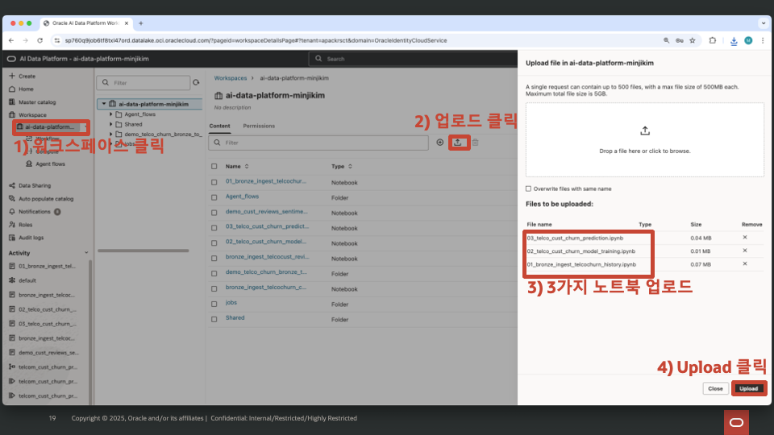

---
## 8.9 Notebook 실행 및 실습 진행 순서

AIDP Workspace에서 Notebook을 실행할 때는 **반드시 Spark 클러스터 연결(Attach)** 을 먼저 수행해야 합니다.  
클러스터가 연결되지 않으면 Notebook 실행이 불가능하므로 아래 순서를 반드시 따라 진행합니다.

---

## 8.9.1 Notebook 실행 순서 안내
### 1) Workspace 이동

좌측 메뉴에서  
**Workspace → (예: ai-data-platform-minjkim)** 을 클릭합니다.

- 중앙 **Content** 영역에서 업로드된 Notebook 3개를 확인합니다:
  - `01_bronze_ingest_telcochurn_history.ipynb`
  - `02_telco_cust_churn_model_training.ipynb`
  - `03_telco_cust_churn_prediction.ipynb`

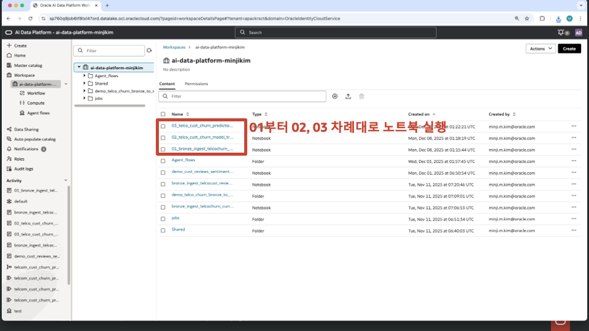

---

### 2) Notebook 열기 (클러스터 연결 버튼 보이기 위함)

클러스터 설정 메뉴는 Notebook을 열어야만 표시됩니다.

- 먼저 `01_bronze_ingest_telcochurn_history.ipynb` 를 클릭해 Notebook을 엽니다.

Notebook 화면 오른쪽 상단에 **Cluster / Compute 설정 메뉴**가 나타납니다.

---

### 3) Spark 클러스터 연결(Attach)

Notebook에서 클러스터를 연결합니다.

- 우측 상단 **Cluster** 영역 클릭  
- 생성해둔 클러스터(예: `notebook`)가 **Active** 상태인지 확인  
- **Attach Existing Cluster** 버튼 클릭

정상 연결되면 클러스터가 Notebook에 연결된 상태로 표시됩니다.

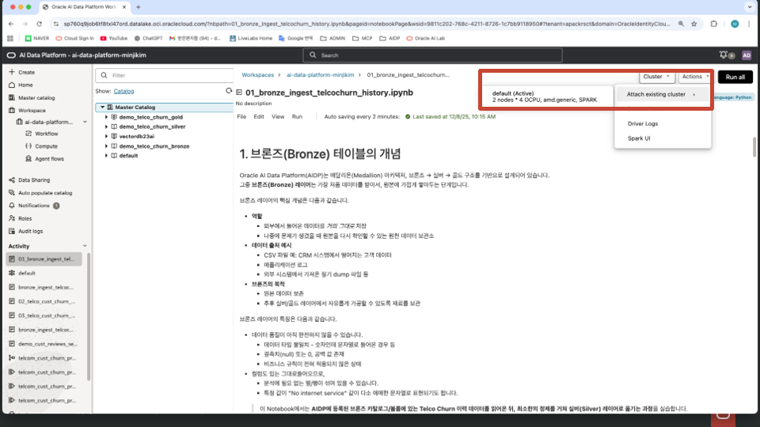

---

### 4) Notebook 실행

클러스터가 연결된 후에 Notebook을 실행할 수 있습니다.

- 상단 메뉴의 **Run all** 또는  
  셀(Cell)을 한 줄씩 실행하며 진행

Notebook은 반드시 아래 순서대로 실행합니다:

1. **01번 Notebook**  
   → 브론즈 원본 데이터 읽기 → 실버 저장 준비  
2. **02번 Notebook**  
   → 실버 데이터 기반 ML 모델 학습  
3. **03번 Notebook**  
   → 학습된 모델로 예측 수행 → 골드 레이어 저장

---

## 8.9.2 Notebook 별 역할 요약

---

## 1) 01번 Notebook  
### **브론즈(Bronze) → 실버(Silver) 데이터 인제스트**

01번 Notebook은 브론즈 레이어의 **원본 Telco Churn 이력 데이터를 읽고**, 필요한 컬럼만 선별·정제하여 실버 레이어에 저장하는 단계입니다.

**주요 흐름**
- 브론즈 Volume의 CSV 파일을 Spark로 로드
- 분석/모델링용 컬럼만 선택하고 불필요한 컬럼 제거
- 최근 연도 등 간단한 필터 적용
- 정제된 데이터를 실버 Catalog 테이블 또는 파일로 저장  

→ 브론즈 원본 데이터를 **모델 학습에 적합한 실버 데이터셋으로 변환하는 과정**

---

## 2) 02번 Notebook  
### **실버(Silver) 데이터 기반 고객 이탈 예측 모델 학습**

02번 Notebook은 실버 데이터셋을 활용해 **고객 이탈 예측 모델(Logistic Regression)** 을 학습하고 그 결과를 **Spark ML Pipeline 모델로 저장**하는 단계입니다.

**주요 흐름**
- 실버 테이블에서 학습 데이터 로드
- 범주형 컬럼 인덱싱/원핫인코딩 + 수치형 컬럼 결합
- Spark ML Pipeline 구성 후 모델 학습
- Train/Test 분리 및 ROC AUC 성능 평가
- 학습된 Pipeline 모델을 Workspace에 저장  

→ 실버 데이터를 기반으로 한 **고객 이탈 Prediction 모델 학습·평가·저장 단계**

---

## 3) 03번 Notebook  
### **골드(Gold) 레이어 예측 결과 생성 및 저장**

03번 Notebook은 실버의 **현재 고객 데이터**와 02번에서 저장된 **Pipeline 모델**을 활용해 고객 이탈 예측을 수행하고, 결과를 골드 레이어에 저장하는 단계입니다.

**주요 흐름**
- 현재 고객 데이터 로드 및 기본 정제
- 저장된 Pipeline 모델 로드
- 고객 이탈 예측값·확률 생성
- 기술적 컬럼 제거 후 비즈니스용 컬럼만 남김
- 골드 Catalog에 Delta 테이블로 저장 (초기 생성 또는 누적 저장)  

→ 예측된 고객 이탈 결과를 **비즈니스에서 직접 활용 가능한 골드 테이블로 제공**

---
