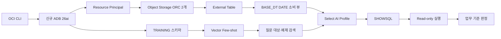

# 신규 ADB에서 Object Storage·Select AI·Vector Few-shot 구성하기

이 실습은 빈 Oracle Autonomous AI Database 26ai에 소형 ORC 데이터를 연결하고 자연어 질문에서
SQL 생성·실행까지 검증하는 과정입니다. 운영 데이터 전체를 복제하지 않고 한 날짜의 작은
객체 두 개만 사용합니다.

## 학습 목표

- OCI Resource Principal과 DB 권한의 역할을 구분한다.
- ORC External Table과 업무용 소비 뷰를 분리한다.
- Select AI가 조회할 수 있는 객체를 Profile로 제한한다.
- Vector 검색 결과를 Few-shot 문맥으로 사용하는 이유를 이해한다.
- `SHOWSQL` 성공과 업무 정답을 구분해 판정한다.

## 전체 흐름



상세 구성은 [아키텍처](docs/architecture.md), 실제 검증 사례는
[실행 결과](docs/execution-result.md), 오류별 확인 순서는
[트러블슈팅](docs/troubleshooting.md)을 참고합니다.

## 준비물

- OCI CLI와 사용할 Profile
- ADB를 만들 권한이 있는 OCI compartment
- Object Storage bucket과 작은 ORC 객체 2개
- SQLcl 26.2 이상과 ADB Wallet
- OCI Generative AI 사용 권한과 현재 사용 가능한 text/embedding model

`.env.example`을 복사하되 실제 값은 Git 밖의 mode `600` 파일 또는 Secret Manager에 둡니다.

## 1. 신규 ADB 생성

교육 환경은 Autonomous Database for Developers를 우선 사용합니다. 서비스 계약과 quota는
실습 시점의 OCI Console·CLI에서 다시 확인합니다. 예시 CLI의 값은 placeholder로 유지합니다.

```bash
oci db autonomous-database create \
  --profile "$OCI_CLI_PROFILE" \
  --compartment-id "$ADB_COMPARTMENT_OCID" \
  --db-name "$ADB_DB_NAME" \
  --display-name "$ADB_DISPLAY_NAME" \
  --db-version 26ai \
  --db-workload DW \
  --compute-model ECPU \
  --compute-count 4 \
  --data-storage-size-in-gbs 20 \
  --is-dev-tier true \
  --is-mtls-connection-required true
```

`AVAILABLE` 상태가 된 뒤 Wallet을 별도 보안 경로에 내려받고 `low` service로 먼저 접속합니다.
배너만으로 성공 처리하지 말고 다음 SELECT와 SQLcl exit code 0을 확인합니다.

```sql
SELECT USER, SYSTIMESTAMP FROM DUAL;
```

## 2. 스키마와 최소 권한

`ADMIN`으로 [01_bootstrap.sql](sql/01_bootstrap.sql)을 실행합니다. 스크립트는 암호를 HIDE로
입력받고 다음 권한만 부여합니다.

- 세션, 테이블, 뷰, 프로시저 생성
- `DBMS_CLOUD`, `DBMS_CLOUD_AI`, `DBMS_VECTOR` 사용
- External Table 생성에 필요한 `DATA_PUMP_DIR` 접근
- Object Storage Resource Principal

Resource Principal의 실제 bucket 접근 범위는 DB GRANT가 아니라 OCI Dynamic Group과 IAM
Policy가 결정합니다.

```text
Allow dynamic-group <ADB_DYNAMIC_GROUP> to read objects in compartment <DATA_COMPARTMENT>
  where target.bucket.name = '<TRAINING_BUCKET>'
Allow dynamic-group <ADB_DYNAMIC_GROUP> to inspect buckets in compartment <DATA_COMPARTMENT>
```

Dynamic Group은 교육용 ADB 하나의 OCID만 매칭하도록 만듭니다.

## 3. Object Storage 접근 사전검증

`TRAINING` 계정으로 작은 파일 하나를 먼저 읽습니다. 객체 전체 목록이나 대용량 scan보다
정확한 URI 한 개의 `GET_OBJECT` 성공을 먼저 확인하는 편이 원인 분리에 유리합니다.

```sql
SELECT DBMS_LOB.GETLENGTH(
         DBMS_CLOUD.GET_OBJECT(
           credential_name => 'OCI$RESOURCE_PRINCIPAL',
           object_uri       => '<ONE_SMALL_OBJECT_URI>'
         )
       ) AS OBJECT_BYTES
FROM DUAL;
```

## 4. External Table과 소비 뷰

`TRAINING` 계정으로 [02_external_tables.sql](sql/02_external_tables.sql)을 실행합니다.

```text
@sql/02_external_tables.sql \
  <OBJECT_URI_ROOT> <USER_ORC_OBJECT> <BIZ_ORC_OBJECT>
```

물리 `_EXT` 테이블은 ORC와 Hive partition을 그대로 표현합니다. `schema=first`에서
`BASE_DT`가 `VARCHAR2`로 탐지될 수 있으므로 Select AI에는 다음 소비 뷰를 노출합니다.

```text
GAME_USER_MST_EXT.BASE_DT VARCHAR2
  → GAME_USER_MST.BASE_DT DATE
```

컬럼 목록은 `USER_TAB_COLUMNS`에서 생성하므로 ORC 컬럼을 애플리케이션 코드에 복제하지 않습니다.

## 5. 데이터 계약 검증

[03_verify.sql](sql/03_verify.sql)을 실행합니다.

검증 항목:

1. External Table 2개와 소비 뷰 2개가 `VALID`
2. `_EXT.BASE_DT`는 `VARCHAR2`, 소비 뷰는 `DATE`
3. 지정 날짜 sample row가 존재
4. 표준 AU와 사업 AU 집계 SQL이 read-only로 실행

실습 데이터가 비어 있으면 count 0은 정상 결과입니다. SQL 실행 실패와 0건을 구분합니다.

## 6. Select AI Profile

현재 model catalogue를 먼저 조회해 실제 사용 가능한 모델 ID를 선택합니다. 문서의 과거 모델명을
그대로 고정하지 않습니다.

```bash
oci generative-ai model list \
  --profile "$OCI_CLI_PROFILE" \
  --compartment-id "$AI_COMPARTMENT_OCID" \
  --all
```

API signing credential 또는 지원되는 Resource Principal credential을 DB에 등록한 뒤
[04_select_ai_profile.sql](sql/04_select_ai_profile.sql)을 실행합니다.

```text
@sql/04_select_ai_profile.sql \
  <AI_COMPARTMENT_OCID> <AI_CREDENTIAL_NAME> <PROFILE_NAME> \
  <MODEL_ID> <AI_REGION> <PROVIDER_ENDPOINT>
```

Profile의 `object_list`는 소비 뷰 두 개만 포함합니다. 원본 `_EXT`와 다른 스키마의 객체는
질문으로 접근할 수 없습니다.

## 7. Vector Few-shot

[05_vector_fewshot.sql](sql/05_vector_fewshot.sql)은 검증된 질문·SQL 예제를 embedding으로
저장하고 유사 질문의 Top-K를 찾는 최소 구조를 만듭니다. Embedding credential은 SQL 파일에
private key를 넣지 말고 런타임에 별도로 등록합니다.

질문에 한국어를 넣어 SQLcl로 전달할 때는 UTF-8 문자열을 Base64 ASCII로 변환한 뒤 DB에서
복원합니다. 직접 한국어 SQL literal을 사용하면 client 문자셋에 따라 검색이 달라질 수 있습니다.

## 8. 자연어 SQL 검증

처음에는 `SHOWSQL`만 호출합니다. 생성된 SQL을 바로 운영 실행하지 않습니다.

```sql
SELECT DBMS_CLOUD_AI.GENERATE(
         prompt       => '<QUESTION_RECONSTRUCTED_FROM_UTF8_BASE64>',
         profile_name => '<PROFILE_NAME>',
         action       => 'showsql'
       )
FROM DUAL;
```

다음 네 조건을 모두 확인해야 PASS입니다.

- 승인한 테이블만 사용하는가
- 날짜와 집단 정의가 맞는가
- `COUNT`, `COUNT(DISTINCT)`, `SUM`의 의미가 맞는가
- 생성 SQL을 read-only로 실행했을 때 기대 결과가 나오는가

기본 NL2SQL이 불필요한 조건을 추가하면 검증된 Vector 예제를 문맥으로 넣어 다시 생성합니다.
이것이 Few-shot의 역할입니다.

## 9. 종료와 비용 관리

- 실습 후 ADB 유지·정지·삭제를 담당자가 결정합니다.
- Dynamic Group과 IAM Policy도 실습 ADB 수명주기에 맞춰 정리합니다.
- 고객 bucket이나 공유 bucket을 롤백 대상으로 삭제하지 않습니다.
- 대용량 전체 백필, 47문항 회귀, MCP 배포는 이 소형 실습의 다음 단계입니다.

## 실행 순서 요약

```text
ADMIN    : 01_bootstrap.sql
OCI Admin: Dynamic Group + bucket read policy
TRAINING : GET_OBJECT 사전검증
TRAINING : 02_external_tables.sql
TRAINING : 03_verify.sql
TRAINING : AI/Vector credential 런타임 등록
TRAINING : 04_select_ai_profile.sql
TRAINING : 05_vector_fewshot.sql
TRAINING : SHOWSQL → read-only 실행 → 의미 판정
```
