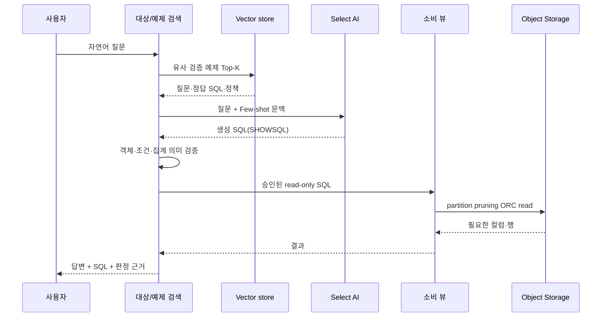
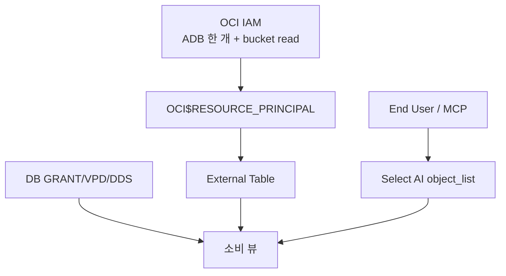

# 아키텍처와 역할

## 구성 요소

| 구성 요소 | 역할 | 관리 주체 |
|---|---|---|
| OCI CLI | ADB와 IAM 리소스 생성·상태 확인 | OCI 관리자 |
| ADB `ADMIN` | 스키마·package·Resource Principal·ACL | DB 관리자 |
| `TRAINING` | External, View, Vector, Select AI 객체 | 데이터·AI 개발자 |
| Object Storage | 날짜 partition ORC 원본 | 데이터 플랫폼 운영자 |
| External Table | ORC 물리 컬럼과 partition 노출 | 데이터·AI 개발자 |
| 소비 뷰 | 날짜 타입과 업무 조회 계약 제공 | 데이터 모델 담당자 |
| Select AI Profile | provider, model, 승인 객체 제한 | AI 운영자 |
| Vector store | 검증 질문·SQL 검색 | QA/Few-shot 운영자 |

## 질문 실행 순서

## 왜 External Table을 직접 Select AI에 주지 않는가

ORC Hive partition의 날짜가 문자열로 노출되면 모델이 자주 만드는 `DATE 'YYYY-MM-DD'`와
비교할 때 실행 오류가 날 수 있습니다. 소비 뷰는 물리 포맷과 질문용 SQL 계약을 분리합니다.
같은 이유로 masking, country name, 표준 집계 정의도 운영에서는 소비 뷰나 집계 계층에 둡니다.

## 보안 경계

IAM은 bucket 접근, DB 권한은 행·열·객체 접근, Select AI Profile은 자연어 SQL이 참조할 객체를
제어합니다. 세 계층을 하나의 인증 성공으로 간주하지 않습니다.
